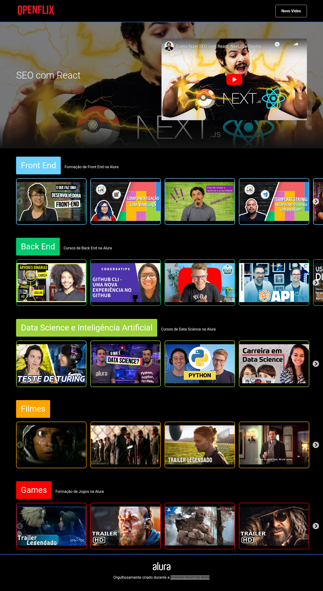

<h1 align="center">
  
</h1>
<p align="center">
  
  
  
  
  <a href="https://github.com/maiquelp/openflix/commits/master">
    
  
  </a>
  <!--  -->
 <br>
  <a href="https://www.linkedin.com/in/maiquelp/">
      
  </a> 
  <!-- <a href="https://insomnia.rest/run/?label=openflix&amp;uri=https%3A%2F%2Fraw.githubusercontent.com%2maiquelp%2Fopenflix%2Fmaster%2F.github%2FInsomnia.json" target="_blank"></a> -->
</p>
<strong>
<br>
<p align="center">
    <a href="README.md">Inglês</a>
    ·
    <a href="README-pt.md">Português</a>
</p>

<p align="center">
  <a href="#bookmark-sobre">Sobre</a>&nbsp;&nbsp;&nbsp;|&nbsp;&nbsp;&nbsp;
  <a href="#computer-tecnologias">Tecnologias</a>&nbsp;&nbsp;&nbsp;|&nbsp;&nbsp;&nbsp;
  <a href="#wrench-ferramentas">Ferramentas</a>&nbsp;&nbsp;&nbsp;|&nbsp;&nbsp;&nbsp;
  <a href="#package-instalação">Instalação</a>&nbsp;&nbsp;&nbsp;|&nbsp;&nbsp;&nbsp;
  <a href="#camera_flash-telas">Telas</a>&nbsp;&nbsp;&nbsp;|&nbsp;&nbsp;&nbsp;
  <a href="#memo-licença">Licença</a>
</p>
</strong>
<br>

## :bookmark: Sobre

O **OpenFlix** é uma plataforma de vídeos inspirada na interface do Netflix. Foi feito com React durante a **Imersão React** da **[Alura](https://www.alura.com.br/)**.

<br>

## :computer: Tecnologias

-  **[Javascript](https://www.w3schools.com/js/)**
-  **[Node.js](https://nodejs.org/)**
-  **[Json-Server](https://github.com/typicode/json-server)**
-  **[ReactJS](https://reactjs.org/)**
-  **[Styled-Components](https://styled-components.com/)**

<br>

## :wrench: Ferramentas

- **[VisualStudio Code](https://code.visualstudio.com/)**
- **[Google Chrome](https://www.google.com/chrome/)**

<br>

## :package: Instalação

### :heavy_check_mark: **Pré-requisitos**

Os seguintes softwares devem estar instalados:
  
  - **[Node.js](https://nodejs.org/en/)**
  - **[Git](https://git-scm.com/)**
  - **[NPM](https://www.npmjs.com/)**

<br>
  
### :arrow_down: **Clonando o repositório**

```sh
  $ git clone https://github.com/maiquelp/openflix.git
```

<br>

### :arrow_forward:	**Rodando as aplicações**

- :computer: Web app

```sh
  # Dependencies install.
  $ npm install
  # Running web app
  $ npm run dev
```

<br>

### :camera_flash: **Telas**



<br>

### :memo: **Licença**

Este projeto está sob uma licença **MIT**.
